# Cloud Engineering Exercises

> Setup

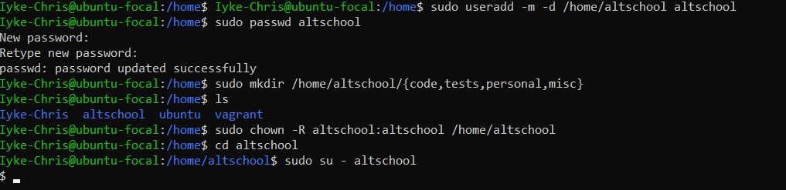

> Change directory to tests directory using absolute pathname

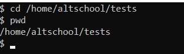

> using relative pathname

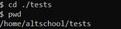

> create fileA with content: Hello A

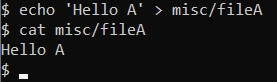

> empty fileB

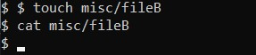

> populate fileB

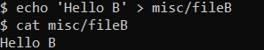

> copy fileA into fileC

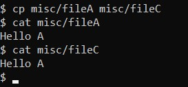

> move fileB into fileD

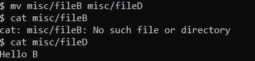

> create misc.tar

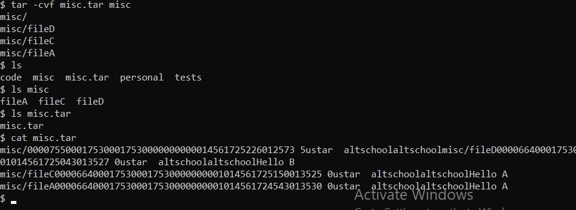

> compress misc.tar

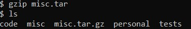

> force new user to change password on login

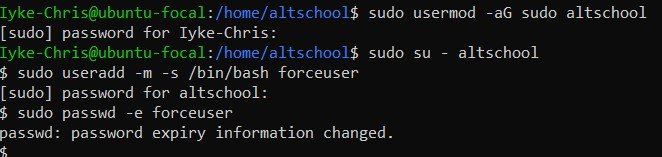

> lock new user password

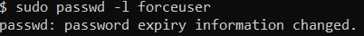

> create user with no login shell

> disable password based auth for ssh

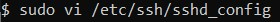

> disable root login for ssh

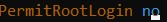

> finalize

